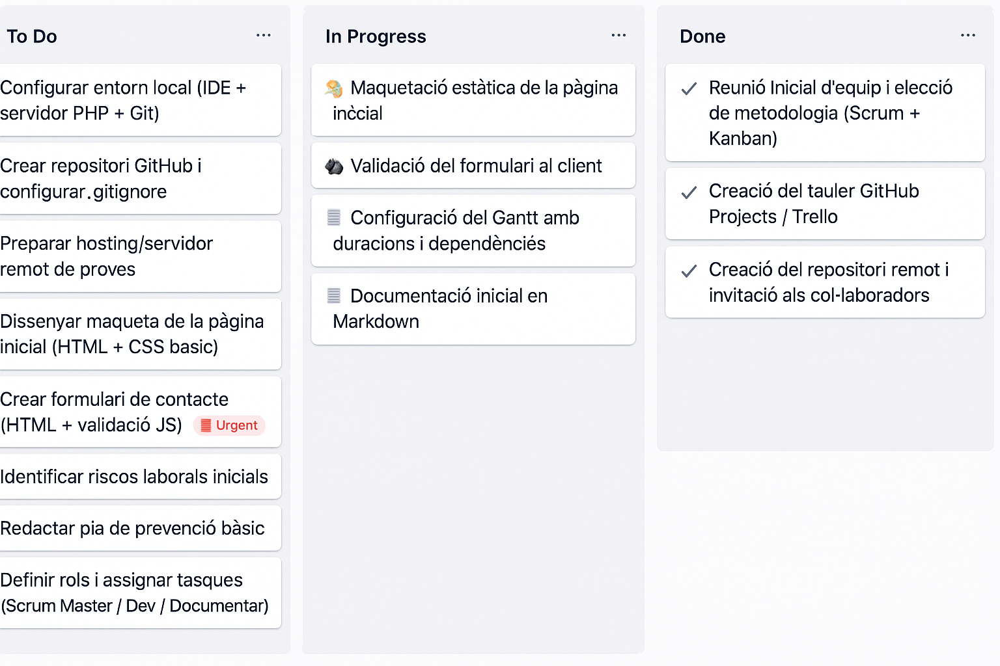

# SA.1 Iteració: Entorn, aparador i contacte

??? abstract "Duració i criteris d'avaluació"

    Duració estimada: 18 hores

    <hr />

    | Resultat d'aprenentatge | Criteris d'avaluació|
    | -------                 | -------             |
    | 1. Planifica l'execució del projecte, determinant el pla d'intervenció i la documentació associada |a) S'han seqüenciat les activitats ordenant-les en funció de les necessitats d' execució.<br/> b) S'han determinat els recursos i la logística necessaris per a cada activitat. <br/> c) S'han identificat les necessitats de permisos i autoritzacions per dur a terme les activitats. <br/>  d) S' han determinat els procediments d' actuació o execució de les activitats.|

## C1. Introducció al mòdul: estructura i metodologia

### 1️⃣ Objectiu
Conéixer l’estructura del **Projecte Integrador de 2n DAW** i la metodologia de treball que seguirem durant el curs.

---

### 2️⃣ Estructura del mòdul
- **Projecte únic**: desenvolupament d’una aplicació web de comerç electrònic (*E-commerce*).
- **Duració**: tot el curs (99 hores → 3h setmanals).
- **Treball en equips de 2 persones**.
- **Iteracions (sprints)**: el projecte es divideix en 6 fases consecutives:
    1. Entorn, aparador i contacte.
    2. Autenticació i gestió de productes.
    3. Disseny responsiu i backend Laravel.
    4. Client SPA amb Vue i control de rols.
    5. Integracions externes i processos asíncrons.
    6. Desplegament final i lliurament del producte.

---

### 3️⃣ Metodologia de treball
- **Àgil** (Scrum/Kanban).
- Cada sprint inclou:
    - Planificació inicial (tasques i cronograma).
    - Execució i documentació.
    - Revisió i validació del que s’ha fet.
- **Gestió de tasques**: tauler Kanban (GitHub Projects / Trello).
- **Control de versions**: Git + GitHub (branques, commits, PRs).
- **Revisions periòdiques**: punts de control al final de cada iteració.

---

### 4️⃣ Responsabilitat individual
- Encara que es treballa en equip, cada alumne ha de ser capaç de:
    - Explicar i defensar les parts en què ha treballat.
    - Mostrar coneixement de totes les fases del projecte.
- Les presentacions i validacions finals són **individuals**.

---

### 5️⃣ Resultat esperat
- Desenvolupar una aplicació web **funcional i documentada**.
- Aprendre a treballar en equip amb metodologies àgils.
- Integrar coneixements de diferents mòduls (DWES, DIW, DWEC, IAW, etc.).

---

👉 En resum: aquest mòdul és un **entrenament pràctic en condicions reals de projecte**, amb entregues iteratives, treball en equip i responsabilitat compartida.


## C2. GitHub Projects / Trello (Gestió àgil del projecte)

### 1️⃣ Què són?
- **GitHub Projects** → Integrat en GitHub, permet gestionar tasques amb **tauler Kanban** i vincular-les directament amb el codi (issues, commits, PRs).
- **Trello** → Eina independent però molt visual, basada també en el sistema **Kanban** (*targetes* en columnes).

---

### 2️⃣ Organització bàsica (Kanban)
Un tauler típic té 3 columnes principals:

| Columna       | Funció                                       |
|---------------|----------------------------------------------|
| **To Do**     | Tasques pendents, encara no iniciades        |
| **In Progress** | Tasques en les quals s’està treballant      |
| **Done**      | Tasques finalitzades i revisades             |

👉 Es poden afegir columnes extra: *Backlog* (idees futures), *Review* (tasques a revisar), *Testing* (en proves).

---

### 3️⃣ Creació de targetes/tasques

Cada tasca conté:

- **Títol** → acció concreta (*“Crear formulari de contacte”*).
- **Descripció** → detalls tècnics, passos a seguir.
- **Assignació** → responsable de la tasca.
- **Labels/etiquetes** → categoria (*bug, feature, urgent, frontend, backend*).
- **Dates límit (deadlines)** → per controlar el temps.
- **Checklists** → llistat de sub-tasques.

---

### 4️⃣ Enllaç amb GitHub
En GitHub Projects es poden:

- Vincular **issues** (incidències) amb una targeta.
- Relacionar un **commit o pull request** amb una tasca → quan es fa *merge*, la tasca pot tancar-se automàticament.
- Exemple: al missatge de commit escriure:

```bash
git commit -m "Add contact form with validation. Fixes #12"
```

👉 Això tanca automàticament l’issue #12 del tauler.  

---

### 5️⃣ Bones pràctiques
- Mantindre el tauler **actualitzat diàriament**.  
- Crear tasques **curtes i clares** (no massa generals, millor dividir-les).  
- Revisar tasques en les **reunions de seguiment** (dailies o setmanals).  
- Fer ús d’**etiquetes** per distingir entre frontend, backend, documentació, bugfix, etc.  
- Relacionar commits i PRs amb les tasques per a millorar la **traçabilitat**.  

---

### 6️⃣ Comparativa ràpida GitHub Projects vs Trello
| Aspecte              | GitHub Projects                        | Trello                          |
|-----------------------|----------------------------------------|---------------------------------|
| **Integració amb codi** | ✅ Molt alta (commits, PR, issues)      | ❌ Limitada (extensions externes) |
| **Senzillesa visual** | Mitjà                                  | Molt alta                       |
| **Col·laboració externa** | Ideal si tot està a GitHub             | Apte per a equips mixtos        |
| **Gratuït**           | Inclòs en GitHub                       | Gratuït amb opcions premium     |

---

### 📌 Exemple pràctic (Iteració 1 – E-commerce)

#### 🟦 To Do

- Configurar entorn local (IDE + PHP + Git)  
- Crear repositori GitHub i `.gitignore`  
- Preparar servidor remot de proves  
- Dissenyar maqueta pàgina inicial (HTML + CSS)  
- Crear formulari de contacte (HTML + validació JS)  
- Identificar riscos laborals inicials  
- Redactar pla de prevenció bàsic  
- Definir rols i assignar tasques  
- Crear cronograma inicial en GanttProject  

#### 🟨 In Progress

- Maquetació pàgina inicial  
- Validació de formulari al client  
- Configuració cronograma Gantt  
- Documentació inicial en Markdown  

#### 🟩 Done

- ✅ Reunió inicial d’equip → metodologia escollida (Scrum + Kanban)  
- ✅ Creació del tauler GitHub Projects / Trello  
- ✅ Creació del repositori remot i invitació als col·laboradors  

<figure>
  
  <figcaption>Exemple Kanban</figcaption>
</figure>
  
---

### 🏷️ Exemple d’etiquetes
- 🖥️ Backend  
- 🎨 Frontend  
- 📄 Documentació  
- 🐞 Bug  
- ⏳ Urgent  
- ⭐ Millora  

## C3. Configuració de l’entorn de treball (local i al núvol)

### 1️⃣ Objectiu
Preparar un **entorn de desenvolupament comú** per a tots els equips, que siga fàcilment replicable i que minimitze els errors entre l’entorn local i el servidor remot.

---

### 2️⃣ Entorn local
- Cada alumne utilitzarà el seu **ordinador personal** amb:
    - **Editor/IDE** (Visual Studio Code recomanat, o PhpStorm).
    - **Control de versions** amb Git.
- L’entorn de programació i base de dades es **simularà amb Docker**.
    - Cada equip haurà de definir i documentar el seu propi **`docker-compose.yml`**, amb contenidors per al servidor web, PHP i la base de dades.
    - L’objectiu és que **tot el grup treballe amb la mateixa configuració**, evitant “funciona al meu ordinador però al teu no”.
- Altres **ferramentes útils**:
    - *Node.js* + *npm* per a frontend (Vue, build tools).
    - *Postman* per provar APIs.
---

### 3️⃣ Entorn remot (núvol)
- **Repositori GitHub** com a punt central del projecte.
- **Servidor de proves**: hosting compartit o VPS amb accés SSH.
- **Bases de dades remotes**: còpies sincronitzades amb l’entorn local.
- **CI/CD (si cal)**: GitHub Actions per desplegar automàticament.
---

### 4️⃣ Bones pràctiques
- Mantindre la configuració de Docker i els scripts documentats al repositori.
- No versionar fitxers sensibles (`.env`).
- Fer còpies periòdiques de la base de dades.
- Evitar “funciona en el meu ordinador” → documentar la configuració.
- Definir al `README.md` o `INSTALL.md` els passos mínims per posar en marxa l’entorn.
  - Passos d’instal·lació de l’entorn.
  - Requisits de versions (PHP, MySQL, Node, etc.).
  - Com executar el projecte en local.
  - Notes per al desplegament remot.
---

### 5️⃣ Exemple mínim d’entorn
Els contenidors bàsics que haurien d’aparéixer són:
- **Servidor web** (Nginx o Apache).
- **PHP** (versió estable, amb les extensions necessàries).
- **Base de dades** (MySQL o MariaDB).

A partir d’aquest esquelet, cada equip ampliarà i personalitzarà la seua configuració.

---

## C4. Introducció a GanttProject (cronograma inicial)

### 1️⃣ Objectiu
Planificar el projecte amb un **cronograma visual** que mostre les tasques, la seua duració i dependències.  
El resultat serà un **diagrama de Gantt** que servirà com a guia inicial del projecte.

---

### 2️⃣ Eina
- **GanttProject**: eina senzilla i gratuïta per crear cronogrames.
- Exporta a diferents formats (PDF, PNG) per poder compartir amb el professorat o incloure en la documentació.

---

### 3️⃣ Elements bàsics del diagrama
- **Tasques**: accions a realitzar (*configurar entorn, crear formulari...*).
- **Duració**: hores o dies que ocuparà cada tasca.
- **Dependències**: algunes tasques no poden començar fins que altres acaben.
- **Fites (milestones)**: punts clau del projecte (p. ex. “Primera entrega”).

---

### 4️⃣ Procediment inicial
1. Crear un **projecte nou** en GanttProject.
2. Afegir les **tasques principals** de l’Iteració 1:
    - Configuració d’entorn (local i remot).
    - Tauler Kanban i repositori GitHub.
    - Cronograma inicial i assignació de rols.
    - Maquetació pàgina inicial.
    - Formulari de contacte.
    - Pla de riscos laborals.
3. Assignar la **duració estimada** de cada tasca.
4. Definir les **dependències** (p. ex. no es pot maquetar fins configurar l’entorn).
5. Exportar i guardar el cronograma en el repositori.

---

### 5️⃣ Bones pràctiques
- Mantindre el cronograma **actualitzat** a mesura que avança el projecte.
- Revisar-lo en cada **punt de control d’iteració**.
- Usar-lo com a eina de comunicació amb el client i el professorat.

---

👉 El cronograma és una **planificació inicial**, no un document rígid: es pot modificar segons les necessitats del projecte.

## C5. Assignació de rols i tasques

### 1️⃣ Objectiu
Repartir el treball de manera clara dins de cada equip, definint **responsabilitats** i **tasques concretes** per a cada alumne.  
Això evita confusions i facilita el seguiment del projecte.

---

### 2️⃣ Rols bàsics en un equip reduït (2 persones)
- **Scrum Master**
    - Organitza i coordina el treball.
    - Dinamitza les reunions de seguiment.
    - Vetla per l’ús correcte de la metodologia i les eines (Kanban, GitHub).

- **Developer**
    - S’encarrega principalment de la implementació tècnica (frontend, backend).
    - Participa en les revisions de codi.

- **Documentador** (a repartir entre els dos membres)
    - Manté al dia el **README.md**, el pla de riscos i altres documents.
    - Assegura que el repositori continga sempre instruccions clares d’instal·lació i ús.

> ⚠️ Encara que hi haja rols, **tots els membres han de conéixer totes les parts** del projecte i poder defensar-les.

---

### 3️⃣ Procediment
1. Decidir els rols inicials dins de l’equip.
2. Crear les **tasques en el tauler Kanban** i assignar-les a un responsable.
3. Revisar periòdicament que el repartiment siga equilibrat.
4. Documentar els rols i responsabilitats en el repositori (README o document específic).

---

### 4️⃣ Bones pràctiques
- Repartir les tasques per **funcionalitats completes**, no per línies de codi.  
  (Exemple: *“Formulari de contacte”* → inclou maquetació, validació i documentació).
- Fer **code reviews creuades**: el company revisa el codi abans de fer *merge*.
- Rotar rols en diferents iteracions per aprendre de totes les parts del projecte.

---

👉 L’assignació de rols i tasques és flexible i pot canviar al llarg del projecte, però sempre ha de quedar registrada i actualitzada.

